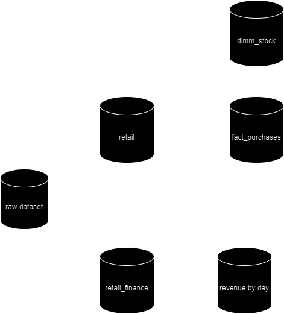
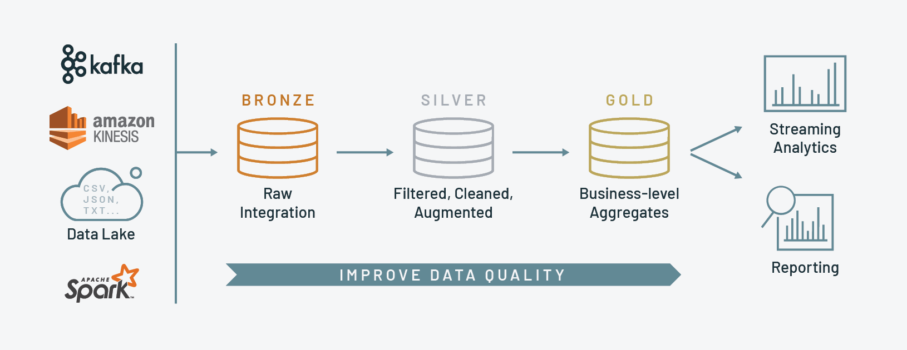

# Airflow DBT Project

This repo I built as a documentation of my learning about data engineering. Here I try to build a data pipeline where data is sourced from one csv which will later be extracted into several new tables which aim to facilitate analysis. This project serves as a practical showcase of the capabilities of these powerful tools in orchestrating data workflows and performing analytics tasks.

# Key Components
1. **Apache Airflow**: As the backbone of our project, Apache Airflow provides a flexible and scalable platform for defining, scheduling, and monitoring data pipelines. Through its intuitive interface, users can easily create workflows to automate data processing tasks.
2. **Google BigQuery**: Leveraging the cloud-native data warehouse capabilities of Google BigQuery, our project demonstrates how to store, query, and analyze large datasets efficiently. With its serverless architecture and SQL-like syntax, BigQuery simplifies the process of deriving insights from your data.
3. **dbt (data build tool)**: dbt empowers us to transform and model our data in a scalable and reproducible manner. With dbt's SQL-based approach to data transformation, we can define data models, run tests, and document our analytics workflows effectively.

# Project Overview
In this project, we showcase a comprehensive data pipeline that incorporates the following key steps:

* Data ingestion: Raw data is ingested from various sources into Google BigQuery using Apache Airflow operators.
* Data transformation: Using dbt, we define SQL-based transformations to clean, enrich, and model the raw data into structured analytics tables.
* Data analysis: Leveraging BigQuery's powerful SQL querying capabilities, we perform analytics and derive insights from the transformed data.
* Workflow orchestration: Apache Airflow schedules and executes the pipeline tasks, ensuring data processing tasks are executed in a timely and efficient manner.

# How to Use
To explore this project, refer to the provided documentation or setup instructions for guidance on configuring Airflow DAGs, dbt models, and connecting to BigQuery. Follow the step-by-step instructions to run the data pipeline and analyze the results. 
## GCP Setups
We need to setups GCP and create bucket cloud storage. You can follow this [video](https://www.youtube.com/watch?v=DzxtCxi4YaA&t=294s) from 6:00 to 10:00. You will get `service_account.json` that contain some of information that can connect our project into our GCS. In the future, DBT also need `service_account.json` to connect in our bucket.

## Installing Dependencies
As we mention before, there are some key tools/dependencies that we need to install.
### Apache Airflow
Follow the instructions in [apache aiflow](https://airflow.apache.org/docs/apache-airflow/stable/howto/docker-compose/index.html) installing guide. We recommend to install docker and docker compose first before installing airflow. 

NOTE: After you following the instruction, make a folder named `include/` in your project folder. It will store some data that will be used in the project such as `dataset.csv` and `service_account.json` to connect to bigquery. Add your `include/` folder in `docker-compose.yaml` volumes

```
volumes:
    - ${AIRFLOW_PROJ_DIR:-.}/dags:/opt/airflow/dags
    - ${AIRFLOW_PROJ_DIR:-.}/logs:/opt/airflow/logs
    - ${AIRFLOW_PROJ_DIR:-.}/config:/opt/airflow/config
    - ${AIRFLOW_PROJ_DIR:-.}/plugins:/opt/airflow/plugins
    - ${AIRFLOW_PROJ_DIR:-.}/include:/opt/airflow/include
```
### Airflow Google Providers 
Installing google providers with running `pip install apache-airflow-providers-google`. This package will help us connecting into bigquery.

### DBT (Data Build Tool)
Installing DBT with running `pip install dbt-core dbt-bigquery`. This package will help us transform,modeling the data and connect to our GCS.

### NOTE
Installing dependencies can be wrap it down with just modifiying `docker-compose.yaml` and adding `Dockerfile` and `requirements.txt`. First we need to prepare our `Dockerfile`.
```
FROM apache/airflow:2.8.3
COPY requirements.txt .
requirements.txt
RUN pip install -r requirements.txt
```

In this part we know the code will install all of dependecies were listed in `requirements.txt`. After that we can prepare our dependencies.
```
apache-airflow-providers-google==10.16.0
dbt-core==1.7.10
dbt-bigquery==1.7.6
```
We can put all of dependencies in here. Dont mind how many library that we need to have in our work. Finally we need to modify our `docker-compose.yaml`. Open the yaml file and comment on line 52 and open comment for line 53. The image of our project will changes based on our `Dockerfile` and it will install our dependencies too. 
```
x-airflow-common:
  &airflow-common
  # In order to add custom dependencies or upgrade provider packages you can use your extended image.
  # Comment the image line, place your Dockerfile in the directory where you placed the docker-compose.yaml
  # and uncomment the "build" line below, Then run `docker-compose build` to build the images.
  # image: ${AIRFLOW_IMAGE_NAME:-apache/airflow:2.8.3}
  build: .
  environment:
```

# What the project does ?
This simple repo work for implementing data transform with DBT. We have 1 raw csv dataset about [online retail](https://www.kaggle.com/datasets/vijayuv/onlineretail) and we will transform into various table based on what we need to have in our database. With DBT we can easly transform our dataset just only typing SQL but with kinda like public variable that can be accessed using DBT format.
```
{{
    config(
        materialized='view',
        schema='finance'
    )
}}

SELECT 
    InvoiceDate,
    count(InvoiceNo) as total_order,
    sum(quantity * unitprice) as total_price
from {{source('airflow_dbt', 'retail')}}
group by 1
order by 1 desc
``` 

And here is an overview of the results of the transformation and analysis that has been done.



# How the project does ?
We focus on DBT to transform our data. We know that it uses sql with the dbt format in there. Before we do that, we ingest our dataset into GCS. You can check how we insert our dataset in `/airflow-project/dags/retail.py`. We build our DAG for ingest the dataset into GCS. 

Now we can do DBT processes. Check on `/airflow-project/dags/dbt/airflow_dbt_gcp/models` to see how we make our new table. It's really simple we just make simple query for make base data from our dataset like stock information and fact purchases and then we make table with information about revenue per day. All of proceses is separated by layer (bronze/silver/gold) you can check about medalion architecture in [here](https://www.advancinganalytics.co.uk/blog/medallion-architecture). 



Dont forget to prepare our data description in `schema.yml`. Make file in each layer we have.

# Profiles.yml
We have `dbt_dag.py` for running our dbt with `BashOperator` and if we check on the code, it says 

`cd {DBT_DIR} && dbt run --profiles-dir .`

We need to pass our profiles.yml for our local into our project folder because we want to run our dbt on docker container. To get the profiles.yml we can execute the code below

```
cd ..
cd .dbt
cat profiles.yml
```

We can copy the entire content of the files and go to our project then do this

```
cd dags/dbt/airflow_dbt_gcp
touch profiles.yml
```

paste the content and change this line
```
dev:
      dataset: retail
      job_execution_timeout_seconds: 500
      job_retries: 1
      keyfile: <NEW-PATH>/service_account.json
      # keyfile: <OLD-PATH>/service_account.json
      location: US
      method: service-account
```
We want dbt knows where is location of `service-account.json` so we need a little changes of our profiles. 

All clear and it's ready to rock!!!

# What can we do in the future?
It's really simple project and we still have plenty of room to make it better like
1. replace the dataset with more complex and more raw dataset.
2. make dags with more complex process.
3. implement dbt macros and many more

# The end
Data engineering is a lot of fun for me, and having good people sharing this knowledge for free really helps me to grow and be more prepared for market demands. Thank you so much mas dio and toni for sharing this knowledge.